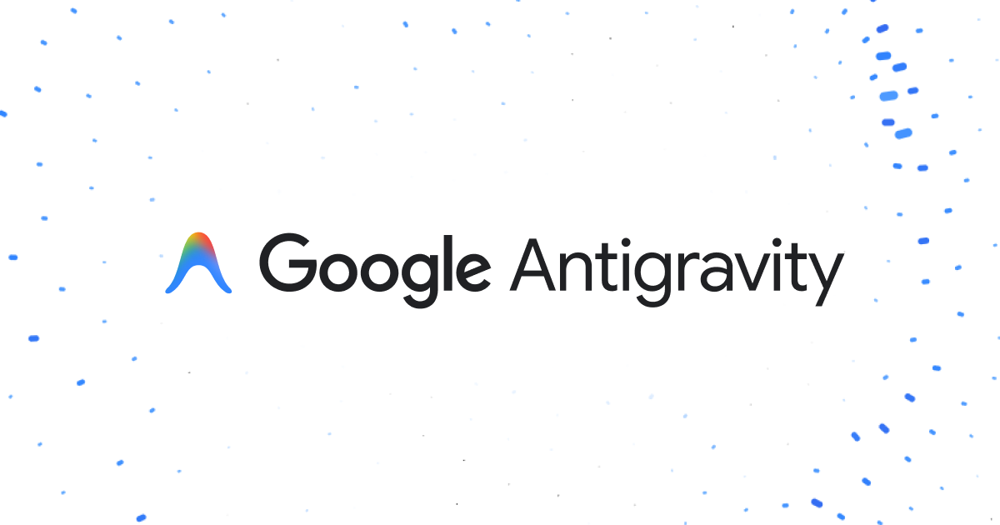
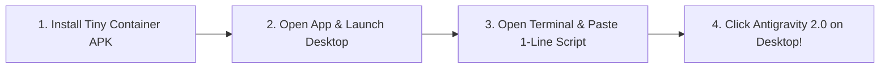

<div align="center">



# Google Antigravity on Android
### The Ultimate AI-Powered Agentic IDE & Desktop Workstation on Mobile

[](https://github.com/erfan2255/debian-on-android)
[](https://antigravity.google)
[-orange.svg?style=for-the-badge&logo=gnu)](https://www.gnu.org/software/libc/)
[](https://github.com/Cateners/tiny_container)
[](LICENSE)

<p align="center">
  <strong>Transform your Android phone or tablet into a state-of-the-art AI Software Engineering powerhouse. Run native Google Antigravity 2.0 with full multi-agent visual canvas, code editor, and terminal agent.</strong>
</p>

---

</div>

## 🌟 Why Antigravity on Android?

**Google Antigravity 2.0** is the next-generation agentic AI development platform featuring autonomous subagents, an interactive visual coding canvas, multi-model support, and integrated artifact intelligence. 

With this project, you can run the **full native desktop GUI of Antigravity 2.0** directly on your Android device (Snapdragon, MediaTek, Exynos, Tablets, Foldables) with:
* ⚡ **Full Native ARM64 Performance:** Runs directly linked against Debian's **GNU C Library (`glibc 2.41`)** — exceeding all official requirements (`glibc >= 2.28`).
* 🎨 **Visual Multi-Agent Canvas:** Create, debug, orchestrate subagents, and edit code visually on your mobile touchscreen or external monitor.
* 🤖 **Antigravity CLI (`agy`):** Run the powerful terminal-based autonomous coding agent alongside the GUI.
* 🔄 **1-Click PC Chat Sync:** Easily import and sync your entire conversation history, transcripts, and projects from your Windows or Mac PC to Android with a single command.
* 🚀 **Zero Hassle Setup:** Choose the beginner-friendly **Tiny Container** app (no commands needed) or the power-user **Termux PRoot** environment.

---

## ⚡ Choose Your Setup Method

| Feature | 📱 Method 1: Tiny Container (Easiest) | 🛠️ Method 2: Termux + Termux-X11 (Power User) |
| :--- | :--- | :--- |
| **Difficulty** | ⭐ **Beginner (1-Click APK)** | ⭐⭐⭐ Intermediate |
| **Setup Time** | ⏱️ **~2 minutes** | ⏱️ ~5 minutes |
| **GUI Frontends** | Built-in AVNC & Termux-X11 | Termux-X11 / VNC Server |
| **Best For** | Ordinary users, tablets, instant plug & play | Developers wanting custom shells & gaming emulation (Wine/Box64) |
| **Installation** | Install APK & run 1-line script | Full automated wizard installer |

---

## 📱 Method 1: Easiest Setup via Tiny Container (Recommended)

[**Tiny Container**](https://github.com/Cateners/tiny_container) is an all-in-one Android app that provides a complete, graphical Linux desktop out of the box with zero complex setup.



### Steps:
1. **Download & Install Tiny Container APK:**
   * Grab the latest APK from the [Tiny Container Releases](https://github.com/Cateners/tiny_container/releases) page and install it on your device.
2. **Open the App:**
   * Open Tiny Container. It will automatically initialize the Debian desktop environment in ~2 minutes.
3. **Run the 1-Line Antigravity Installer:**
   * Open the **Terminal** icon inside your Tiny Container desktop and paste:
   ```bash
   bash -c "$(curl -fsSL https://raw.githubusercontent.com/erfan2255/debian-on-android/main/setup-antigravity.sh)"
   ```
4. **Launch & Enjoy:**
   * Double-click the **Google Antigravity 2.0** icon created on your Desktop or launch it by typing `antigravity` in terminal!

---

## 🛠️ Method 2: Power-User Setup via Termux + PRoot Debian

For developers who want a full customizable stack with Wine gaming emulation and multi-IDE support:

1. **Install Termux & Termux-X11:**
   * Install [Termux](https://github.com/termux/termux-app/releases) (F-Droid / GitHub) and [Termux-X11](https://github.com/termux/termux-x11/releases).
2. **Run the Masterclass Installer Wizard:**
   * Paste the following command in Termux:
   ```bash
   bash -c "$(curl -fsSL https://raw.githubusercontent.com/erfan2255/debian-on-android/main/setup.sh)"
   ```
3. **Launch the Desktop:**
   * Type `start-x11` in Termux and launch Antigravity 2.0 from your desktop!

---

## 🔄 How to Sync Conversations from PC to Android

You can migrate your existing chats, history, artifacts, and memory from your Windows/Mac PC directly into Android:

```
[Windows PC: C:\Users\<User>\.gemini]  --->  [Phone: Download Folder]  --->  [Run 'sync-antigravity']
```

1. **On your PC:** Copy the `.gemini` folder from `C:\Users\<YourUsername>\.gemini` (or `~/.gemini` on Mac/Linux) to your phone's **Download** folder.
2. **On your Android Linux Terminal:** Type:
   ```bash
   sync-antigravity
   ```
3. Open **Google Antigravity 2.0** — all your past chats, projects, and conversation histories are instantly restored!

---

## 🤖 Antigravity CLI Agent (`agy`)

In addition to the full GUI desktop, you can use the autonomous terminal agent:

```bash
# Launch interactive agent
agy

# Ask a direct question or prompt
agy "Refactor this Python script for performance"

# View all CLI commands
agy --help
```

---

## ⚙️ Minimum & Recommended Specifications

| Component | Minimum | Recommended |
| :--- | :--- | :--- |
| **OS** | Android 9+ | Android 12+ (HyperOS, OneUI, OxygenOS) |
| **CPU** | 64-bit ARM (ARMv8 / aarch64) | Snapdragon 865/870/8+ Gen 1/Gen 2/Gen 3, Dimensity 9000+ |
| **RAM** | 4 GB | 8 GB – 12 GB (for heavy multitasking & canvas) |
| **Storage** | 3 GB free space | 10 GB+ free space |
| **Display** | Phone screen (touch) | Tablet (11" - 14") or External Monitor via USB-C DP |

---

## 📜 License & Credits

* **Google Antigravity:** Developed by Google.
* **Tiny Container:** Developed by [Cateners](https://github.com/Cateners/tiny_container).
* **Termux Community:** [Termux](https://github.com/termux) & [Termux-X11](https://github.com/termux/termux-x11).
* **Project Maintainer:** Open source community project. Licensed under [MIT License](LICENSE).
